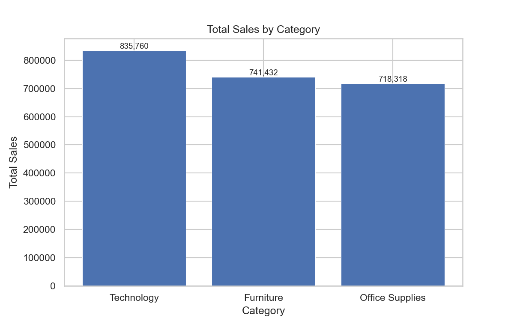
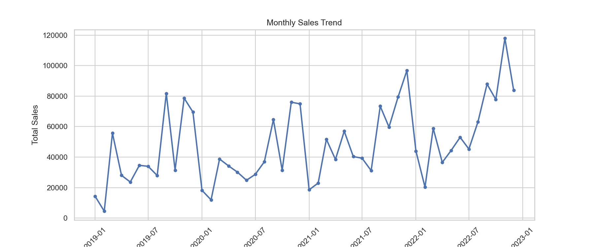
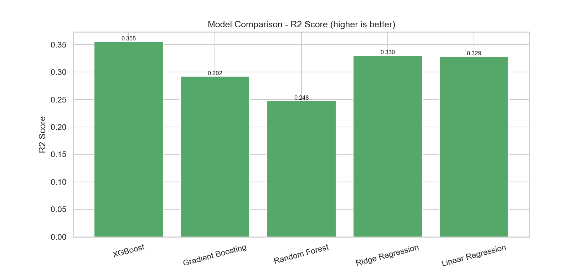
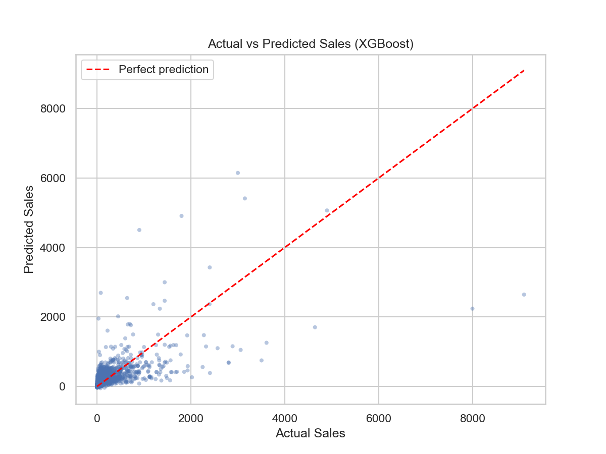
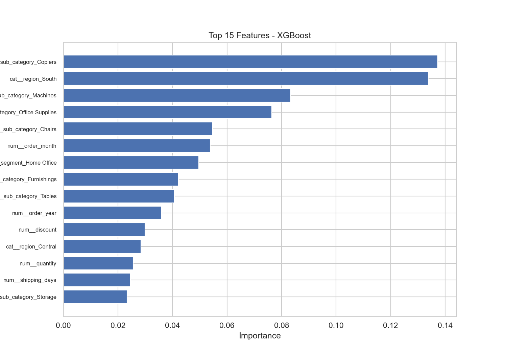

# SuperStore Sales Analysis & Machine Learning

## Project Overview

This project analyzes SuperStore sales data and uses machine learning to predict order-level sales.

The project covers data cleaning, exploratory data analysis, business insights, visualization, machine learning, model comparison, and interactive dashboards.

## Project Goals

- Understand sales and profit performance.
- Find important business patterns.
- Analyze sales by category, region, customer, and product.
- Study the relationship between discount and profit.
- Build machine learning models to predict order-level sales.
- Compare different regression algorithms.
- Evaluate the final model using several regression metrics.

## Dataset

The dataset contains SuperStore order and sales information.

### Dataset Summary

| Metric | Value |
|---|---:|
| Rows | 9,986 |
| Total Sales | $2,295,509.57 |
| Total Profit | $286,013.82 |
| Loss-Making Rows | 1,870 |
| Unique Customers | 793 |

## Data Analysis

The project includes:

- Data cleaning and preprocessing
- Sales and profit analysis
- Category and sub-category analysis
- Regional analysis
- Customer and product analysis
- Monthly sales analysis
- Discount and profit analysis
- Correlation analysis
- Data visualization

## Business Insights

Examples of findings from the analysis:

- **Technology** has the highest total sales.
- **Technology** also has the highest total profit.
- **West** has the highest total sales among the regions.
- A **50% discount** has the lowest average profit, at **-$310.70**.
- **November 2022** was the strongest sales month, with sales of **$117,903.44**.

These findings illustrate how sales, discounts, products, and regions can affect business performance.

## Machine Learning

Five regression algorithms were trained and compared:

1. Linear Regression
2. Ridge Regression
3. Random Forest
4. Gradient Boosting
5. XGBoost

Tree-based models were tuned using 5-fold cross-validation.

### Evaluation Metrics

- MAE — Mean Absolute Error
- MSE — Mean Squared Error
- RMSE — Root Mean Squared Error
- R² Score — Coefficient of Determination

### Model Comparison

| Model | MAE | RMSE | R² Score |
|---|---:|---:|---:|
| XGBoost | **172.258** | **381.006** | **0.3555** |
| Gradient Boosting | 176.818 | 399.254 | 0.2923 |
| Random Forest | 186.071 | 411.613 | 0.2478 |
| Ridge Regression | 197.656 | 388.356 | 0.3304 |
| Linear Regression | 197.865 | 388.883 | 0.3286 |

On the reported test split, XGBoost had the lowest MAE and RMSE and the highest R² among the tested models.

## Visualizations

### Sales by Category



### Monthly Sales Trend



### Model Performance



### Actual vs Predicted Sales



### Feature Importance



The repository also contains interactive HTML dashboards and additional charts.

## Project Structure

```text
SuperStore/
├── data/
│   ├── raw/
│   │   └── superstore.csv
│   └── processed/
│       └── cleaned_superstore.csv
├── outputs/
│   ├── charts/
│   ├── models/
│   └── reports/
├── superstore_analysis (1).ipynb
├── .gitignore
└── README.md
```

## Technologies

- Python
- Pandas
- NumPy
- Matplotlib
- Seaborn
- Scikit-learn
- XGBoost
- Joblib
- Plotly
- Jupyter Notebook

## How to Run

### 1. Clone the repository

```bash
git clone https://github.com/OmidDevAi/SuperStore.git
cd SuperStore
```

### 2. Create and activate a virtual environment

```bash
python -m venv .venv
```

Windows PowerShell:

```powershell
.\\.venv\\Scripts\\Activate.ps1
```

### 3. Install dependencies

```bash
pip install pandas numpy matplotlib seaborn scikit-learn xgboost joblib plotly jupyter
```

### 4. Open the notebook

```bash
jupyter notebook
```

Then open `superstore_analysis (1).ipynb`.

## Limitations

- The model predicts order-level sales; it is not a time-series forecasting model.
- Model performance depends on the available features and the validation strategy.
- Future forecasting would require a time-aware validation approach.

## Future Improvements

- Add time-based forecasting.
- Add customer-level features.
- Improve feature engineering.
- Test additional gradient boosting methods.
- Improve the interactive dashboard.
- Use time-based validation for future forecasting.

## Key Takeaway

This project demonstrates an end-to-end data analysis and machine learning workflow, from raw data cleaning and business analysis to regression modeling, evaluation, and visualization.

## Author

**Omid Rezapour**

GitHub: [OmidDevAi](https://github.com/OmidDevAi)
